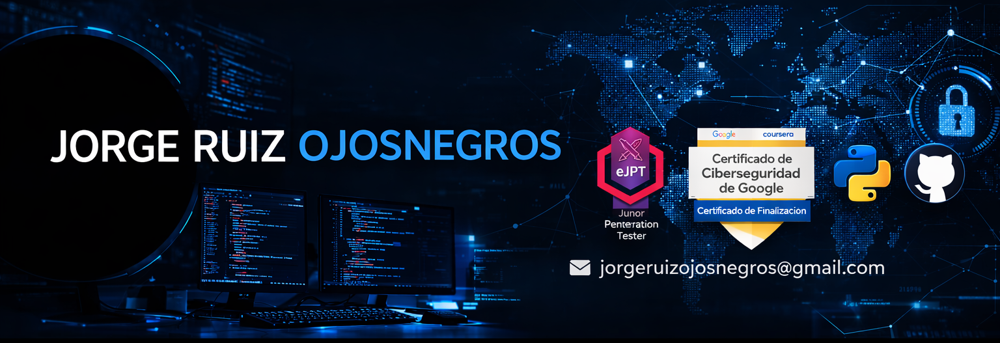

<h1 align="center">🕳️ El sótano de c0k3r0 🕳️</h1>

<code>root@c0k3r0:~# ./welcome.sh</code>

  

---

## 🧠 Sobre mí

🎩 Entusiasta del hacking ético | 🧠 eJPTv2 & Google Cibersecurity Certified | 🔐 Jugador de CTFs  
🖥️ Documentando mi aprendizaje mientras avanzo hacia una carrera en ciberseguridad.

---

## 🧪 Proyectos actuales

- 🔍 **CTF-Writeups** → Portafolio de write-ups de máquinas CTF  
- ⚙️ **OSINT Tools** → Scripts y técnicas para recolección de inteligencia  
- 📁 **Payloads & Cheatsheets** → Repositorio personal de recursos para pentesting

---

## 💻 Herramientas favoritas

### 🛰️ Reconocimiento y Enumeración

### 🔓 Fuerza Bruta / Credenciales

### 🕷️ Pentesting Web / Análisis de Aplicaciones

### 💥 Explotación

### 🩺 Post-Explotación / Privesc

### 📡 Análisis de Red y Forense

### 🐍 Lenguajes y Plataformas

---

## 📊 Actividad en GitHub

---

## 📫 Contacto

- 🔗 [LinkedIn](https://linkedin.com/in/jorge-ruiz-ojosnegros-b5b2922b7)  
- 🌐 Blog: *próximamente...*

---
